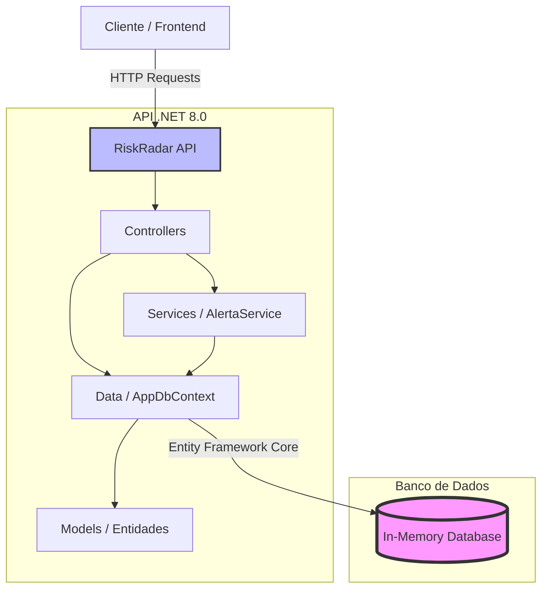
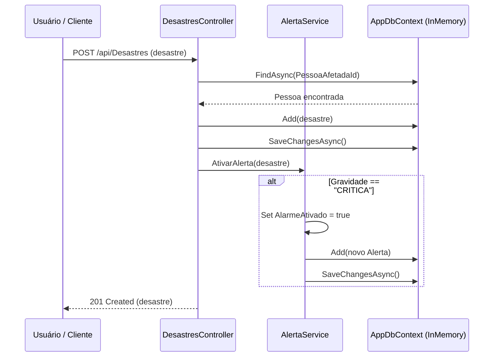

# RiskRadar API

Este projeto implementa uma API RESTful em .NET 8.0 para gerenciar informações sobre desastres, alertas e pessoas afetadas. Ele foi desenvolvido como parte de uma solução global para monitoramento e resposta a situações de risco.

## Integrantes do Grupo
*   **Bruno Ferreira** - RM 563489
*   **Gabriel Robertoni Padilha** - RM 566293
*   **Leonardo Aragaki Rodrigues** - RM 562944

## Sumário
1.  [Estrutura do Projeto](#1-estrutura-do-projeto)
2.  [Modelos de Dados (Entidades)](#2-modelos-de-dados-entidades)
3.  [Contexto do Banco de Dados](#3-contexto-do-banco-de-dados)
4.  [Serviços](#4-serviços)
5.  [Controladores (Endpoints da API)](#5-controladores-endpoints-da-api)
6.  [Arquitetura do Sistema](#6-arquitetura-do-sistema)
7.  [Fluxo de Ativação de Alerta](#7-fluxo-de-ativação-de-alerta)
8.  [Configuração e Execução](#8-configuração-e-execução)
9.  [Testes e Exemplos de Uso da API](#9-testes-e-exemplos-de-uso-da-api)

## 1. Estrutura do Projeto
O projeto `RiskRadar` é uma aplicação .NET 8.0 que segue a arquitetura de API RESTful. A estrutura de pastas principal é organizada da seguinte forma:

*   `Controllers`: Contém os controladores da API que lidam com as requisições HTTP.
*   `Data`: Contém o `DbContext` para interação com o banco de dados.
*   `Models`: Define as classes de modelo de dados (entidades).
*   `Services`: Contém a lógica de negócios e serviços da aplicação.

## 2. Modelos de Dados (Entidades)

### `Alerta`
Representa um alerta gerado no sistema.

| Propriedade       | Tipo     | Descrição                               |
| :---------------- | :------- | :-------------------------------------- |
| `Id`              | `int`    | Identificador único do alerta.          |
| `Mensagem`        | `string` | Mensagem do alerta.                     |
| `Nivel`           | `string` | Nível de gravidade do alerta.           |
| `DataEnvio`       | `DateTime` | Data e hora do envio do alerta.         |
| `PessoaAfetadaId` | `int`    | ID da pessoa afetada associada ao alerta. |
| `PessoaAfetada`   | `PessoaAfetada` | Objeto da pessoa afetada (navegação).   |

### `Desastre`
Representa um evento de desastre.

| Propriedade         | Tipo     | Descrição                                   |
| :------------------ | :------- | :------------------------------------------ |
| `Id`                | `int`    | Identificador único do desastre.            |
| `Tipo`              | `string` | Tipo de desastre (ex: enchente, terremoto). |
| `Gravidade`         | `string` | Nível de gravidade do desastre.             |
| `DataOcorrencia`    | `DateTime` | Data e hora da ocorrência do desastre.      |
| `AlarmeAtivado`     | `bool`   | Indica se um alarme foi ativado para o desastre. |
| `PessoaAfetadaId`   | `int`    | ID da pessoa afetada associada ao desastre. |
| `PessoaAfetada`     | `PessoaAfetada` | Objeto da pessoa afetada (navegação).       |

### `PessoaAfetada`
Representa uma pessoa afetada por um desastre.

| Propriedade       | Tipo     | Descrição                               |
| :---------------- | :------- | :-------------------------------------- |
| `Id`              | `int`    | Identificador único da pessoa afetada.  |
| `Nome`            | `string` | Nome completo da pessoa.                |
| `CPF`             | `string` | CPF da pessoa.                          |
| `Telefone`        | `string` | Número de telefone da pessoa.           |
| `Endereco`        | `string` | Endereço da pessoa.                     |
| `NecessitaResgate`| `bool`   | Indica se a pessoa necessita de resgate. |
| `IdDesastre`      | `int`    | ID do desastre associado à pessoa.      |
| `Alertas`         | `List<Alerta>` | Lista de alertas associados à pessoa.   |

## 3. Contexto do Banco de Dados

O `AppDbContext` é configurado para usar um banco de dados em memória (`RiskRadarDb`), o que é ideal para desenvolvimento e testes. Ele expõe os seguintes `DbSet`s:

*   `Pessoas`: Para gerenciar `PessoaAfetada`.
*   `Desastres`: Para gerenciar `Desastre`.
*   `Alertas`: Para gerenciar `Alerta`.

## 4. Serviços

### `AlertaService`
Responsável pela lógica de ativação de alertas.

*   **`AtivarAlerta(Desastre desastre)`**: Verifica a gravidade do desastre. Se for "CRITICA", ativa o alarme do desastre e cria um novo registro de `Alerta` no banco de dados.

## 5. Controladores (Endpoints da API)

### `AlertasController`
Gerencia operações relacionadas a alertas.

| Método HTTP | Endpoint              | Descrição                                     | Parâmetros de Requisição | Corpo da Requisição | Resposta de Sucesso | Resposta de Erro |
| :---------- | :-------------------- | :-------------------------------------------- | :--------------------- | :------------------ | :------------------ | :--------------- |
| `GET`       | `/api/Alertas`        | Obtém todos os alertas.                       | Nenhum                 | Nenhum              | `200 OK` (Lista de Alertas) |                  |
| `GET`       | `/api/Alertas/{id}`   | Obtém um alerta específico por ID.            | `id` (int)             | Nenhum              | `200 OK` (Alerta)   | `404 Not Found`  |
| `POST`      | `/api/Alertas`        | Cria um novo alerta.                          | Nenhum                 | Objeto `Alerta`     | `201 Created`       | `400 Bad Request`|
| `PUT`       | `/api/Alertas/{id}`   | Atualiza um alerta existente.                 | `id` (int)             | Objeto `Alerta`     | `204 No Content`    | `400 Bad Request`|
| `DELETE`    | `/api/Alertas/{id}`   | Exclui um alerta por ID.                      | `id` (int)             | Nenhum              | `204 No Content`    | `404 Not Found`  |

### `DesastresController`
Gerencia operações relacionadas a desastres.

| Método HTTP | Endpoint              | Descrição                                     | Parâmetros de Requisição | Corpo da Requisição | Resposta de Sucesso | Resposta de Erro |
| :---------- | :-------------------- | :-------------------------------------------- | :--------------------- | :------------------ | :------------------ | :--------------- |
| `GET`       | `/api/Desastres`      | Obtém todos os desastres.                     | Nenhum                 | Nenhum              | `200 OK` (Lista de Desastres) |                  |
| `GET`       | `/api/Desastres/{id}` | Obtém um desastre específico por ID.          | `id` (int)             | Nenhum              | `200 OK` (Desastre) | `404 Not Found`  |
| `POST`      | `/api/Desastres`      | Cria um novo desastre e ativa alerta se crítico. | Nenhum                 | Objeto `Desastre`   | `201 Created`       | `400 Bad Request`|
| `PUT`       | `/api/Desastres/{id}` | Atualiza um desastre existente.               | `id` (int)             | Objeto `Desastre`   | `204 No Content`    | `400 Bad Request`|
| `DELETE`    | `/api/Desastres/{id}` | Exclui um desastre por ID.                    | `id` (int)             | Nenhum              | `204 No Content`    | `404 Not Found`  |

### `PessoasController`
Gerencia operações relacionadas a pessoas afetadas.

| Método HTTP | Endpoint              | Descrição                                     | Parâmetros de Requisição | Corpo da Requisição | Resposta de Sucesso | Resposta de Erro |
| :---------- | :-------------------- | :-------------------------------------------- | :--------------------- | :------------------ | :------------------ | :--------------- |
| `GET`       | `/api/Pessoas`        | Obtém todas as pessoas afetadas.              | Nenhum                 | Nenhum              | `200 OK` (Lista de Pessoas) |                  |
| `GET`       | `/api/Pessoas/{id}`   | Obtém uma pessoa afetada específica por ID.   | `id` (int)             | Nenhum              | `200 OK` (PessoaAfetada) | `404 Not Found`  |
| `POST`      | `/api/Pessoas`        | Cria uma nova pessoa afetada.                 | Nenhum                 | Objeto `PessoaAfetada` | `201 Created`       |                  |
| `PUT`       | `/api/Pessoas/{id}`   | Atualiza uma pessoa afetada existente.        | `id` (int)             | Objeto `PessoaAfetada` | `204 No Content`    | `400 Bad Request`|
| `DELETE`    | `/api/Pessoas/{id}`   | Exclui uma pessoa afetada por ID.             | `id` (int)             | Nenhum              | `204 No Content`    | `404 Not Found`  |

## 6. Arquitetura do Sistema

A arquitetura do sistema RiskRadar é composta por um cliente (frontend ou outra aplicação) que interage com a API RESTful. A API, por sua vez, utiliza controladores para rotear as requisições, serviços para a lógica de negócios e um contexto de banco de dados para persistência de dados em um banco de dados em memória.



## 7. Fluxo de Ativação de Alerta

O fluxo de ativação de alerta ocorre quando um novo desastre é registrado e sua gravidade é classificada como "CRITICA".



## 8. Configuração e Execução

Para configurar e executar o projeto localmente, siga os passos abaixo:

### Pré-requisitos
*   [.NET SDK 8.0](https://dotnet.microsoft.com/download/dotnet/8.0)

### Passos
1.  **Clone o repositório:**
    ```bash
    git clone <URL_DO_SEU_REPOSITORIO>
    cd .NET_Global Solution - RiskRadar/Global Solution - RiskRadar
    ```
2.  **Restaure as dependências:**
    ```bash
    dotnet restore
    ```
3.  **Execute a aplicação:**
    ```bash
    dotnet run
    ```

A aplicação será iniciada e estará disponível em `https://localhost:7001` (ou outra porta configurada). A interface Swagger UI estará acessível em `https://localhost:7001/swagger`.

## 9. Testes e Exemplos de Uso da API

Não foram encontrados arquivos de teste automatizados explícitos na estrutura do projeto. No entanto, a API pode ser testada manualmente utilizando a interface Swagger UI ou ferramentas como Postman/Insomnia.

### Acesso à Swagger UI
Após executar a aplicação, acesse `https://localhost:7001/swagger` no seu navegador. Lá você encontrará a documentação interativa de todos os endpoints da API, permitindo que você envie requisições e visualize as respostas diretamente.

### Exemplos de Requisições (usando `curl` ou Postman/Insomnia)

#### Criar uma Pessoa Afetada

**Requisição:**
```http
POST /api/Pessoas
Content-Type: application/json

{
  "nome": "Maria Silva",
  "cpf": "123.456.789-00",
  "telefone": "(11) 98765-4321",
  "endereco": "Rua das Flores, 123",
  "necessitaResgate": true,
  "idDesastre": 0
}
```

**Resposta (Exemplo):**
```json
{
  "id": 1,
  "nome": "Maria Silva",
  "cpf": "123.456.789-00",
  "telefone": "(11) 98765-4321",
  "endereco": "Rua das Flores, 123",
  "necessitaResgate": true,
  "idDesastre": 0,
  "alertas": []
}
```

#### Criar um Desastre (com ativação de alerta)

**Requisição:**
```http
POST /api/Desastres
Content-Type: application/json

{
  "tipo": "Enchente",
  "gravidade": "CRITICA",
  "dataOcorrencia": "2024-06-10T10:00:00Z",
  "alarmeAtivado": false,
  "pessoaAfetadaId": 1
}
```

**Resposta (Exemplo):**
```json
{
  "id": 1,
  "tipo": "Enchente",
  "gravidade": "CRITICA",
  "dataOcorrencia": "2024-06-10T10:00:00Z",
  "alarmeAtivado": true,
  "pessoaAfetadaId": 1,
  "pessoaAfetada": null
}
```

*Nota: A propriedade `alarmeAtivado` no corpo da requisição será sobrescrita pela lógica do serviço se a gravidade for "CRITICA".*

#### Obter todos os Alertas

**Requisição:**
```http
GET /api/Alertas
```

**Resposta (Exemplo):**
```json
[
  {
    "id": 1,
    "mensagem": "ALERTA DE EMERGÊNCIA - CATÁSTROFE DETECTADA",
    "nivel": "CRITICA",
    "dataEnvio": "2024-06-10T10:00:00Z",
    "pessoaAfetadaId": 1,
    "pessoaAfetada": {
      "id": 1,
      "nome": "Maria Silva",
      "cpf": "123.456.789-00",
      "telefone": "(11) 98765-4321",
      "endereco": "Rua das Flores, 123",
      "necessitaResgate": true,
      "idDesastre": 0,
      "alertas": []
    }
  }
]
```

## Referências

*   [.NET SDK 8.0](https://dotnet.microsoft.com/download/dotnet/8.0)
